# UGC爆款产品需求文档

CreatiSignal · V1.1 沉浸式浏览版 · 2026年9月8日

供产品、设计、内容采集、前端、后端和运营共同评审。本文描述用户看到什么、能做什么、内容如何入选和发布、如何验收，不限定技术实现方式。

本版取代V1.0中的视频列表浏览方案。按用户提供的TikTok网页版截图，将客户主体验调整为“进入即刷、单条大视频居中、上下切换、侧边操作”。本文与示例图均为需求说明，不包含开发Demo。

## 需求背景

客户提出两类需求：找到粉丝不足1万的账号发布的AI视频，参考其创意并生成自己的素材；让运营人员每天浏览优质热门视频，积累对题材、开头、演示和节奏的判断。当前已有一个经过日常使用、持续获得高互动AI视频推荐的TikTok账号，可作为首版内容发现入口。

我们希望把这批推荐内容整理成每日更新、经过审核、可以直接进入创作的平台内容池。推荐账号推送是候选内容来源；内容是否适合客户、是否属于AI、是否足够热门，仍由明确规则和运营审核决定。

## 需求目标

- 用户价值：减少寻找小体量账号优质AI视频的时间，完成“看懂参考 → 收藏积累 → 复刻创作”。
- 使用习惯：让运营人员有稳定的每日回访理由，观察有效使用天数、周内重复访问和内容行动，而不仅是页面打开量。
- 产品目标：提升平台WAU及有效活跃，提高从灵感发现到复刻的转化；通过分批开放试点验证，不能把新增浏览直接解释为审美或业务能力提升。

## 已确认的产品决定

| 项目 | 本版约定 |
|---|---|
| 菜单位置 | 灵感发现分组内，紧接“灵感发现”下方，位于“品牌追踪”上方 |
| 菜单名称 | UGC爆款；截图中的“AIGC爆款”作为原位置参考，最终统一使用UGC爆款 |
| 粉丝范围 | 首次进入默认“万粉以下”，允许主动切换到“全部精选” |
| 内容分发 | 所有用户共享已发布内容池；同条件、同版本、同排序下结果一致 |
| 内容深度 | 继续浏览即可看到更多历史精选；不设置刷视频解锁等级 |
| 收藏去向 | 我的资产 → 收藏栏目；与UGC爆款内收藏状态同步 |
| 浏览形态 | 单条大视频为中心的沉浸式信息流；直接进入播放，不先经过视频列表 |
| 核心动作 | 上下刷视频、收藏、下载、一键复刻、查看原视频和作者主页 |

文中数量、时间和试点门槛为建议初始值，可在评审时整体调整；用户已确认的上述决定作为本版基线。原型中的账号、封面和数字均为演示数据。

<!-- page -->

# 核心用户场景与主链路

## 场景一 找到小账号也能做出的好创意

电商运营打开UGC爆款，默认看到万粉以下作者发布的精选AI视频。直接播放首条视频，通过紧凑筛选切换品类，按需展开播放、互动、粉丝数与发布日期，确认创意是否适合自己的商品。发现值得参考的视频后收藏，或点击一键复刻，进入已有创作流程。

成功表现：无需离开平台反复寻找素材，能明确知道参考的看点，并顺利带入正确视频。

## 场景二 每天刷一会儿积累网感

运营人员每天查看今日更新，连续浏览视频，查看“值得学什么”，收藏有用的创意。当天内容看完后可以继续看历史精选。回来时能找到上次位置，同时知道是否有新内容。

成功表现：一周多天发生有效观看，并能积累收藏或产生后续创作；观看时长仅作为辅助指标。

## 场景三 从收藏回到创作

用户进入“我的资产 → 收藏”，找到此前保存的视频，再次预览、查看作者、下载或一键复刻。无需重新去UGC爆款逐条寻找；取消收藏不会删除已创建的复刻项目。

## 场景四 运营保持每日内容质量

平台运营检查当日新增候选视频，排除不相关内容和重复素材，确认AI依据、表现数据及功能可用性，补充看点，编排后发布。来源供给不足时，从审核通过的储备中补充，不能用未审核内容凑数。

## 用户链路

灵感发现 → UGC爆款 → 默认万粉以下 → 直接播放首条 → 上下刷视频 → 按需展开看点与详情 → 收藏至我的资产／下载／一键复刻 → 在已有项目中继续创作。

## 内容链路

推荐账号发现 → 当日候选池 → 去重与初筛 → 人工审核 → 审核通过储备 → 每日编排 → 发布到共享内容池 → 持续维护或下架。

浏览、收藏和进度属于用户个人状态；标签、视频数据、上架顺序和下架结果属于全局内容状态。个人偏好不会训练公共推荐账号，也不会改变其他用户看到的内容。

<!-- page -->

# 内容定义与入选标准

## 什么是UGC爆款

本模块收录TikTok账号公开发布、具有可学习价值的AI相关视频。它是来自有限推荐来源的运营精选集合，不表示覆盖TikTok全站，也不宣称是平台官方榜单。可以包含产品演示、AI剧情、视觉创意、拟人角色等；不要求全部为带货视频。

## AI属性与相关性

| 审核结论 | 入选规则 | 对用户的展示 |
|---|---|---|
| 明确AI | 原视频AI标注，或作者公开说明使用AI；记录依据 | AI标注 |
| 人工判断AI | 运营看完整条后认为有充分依据，记录判断理由 | 人工判断AI |
| 待核实 | 暂无法判断，或只有转发者猜测 | 留在待复核，不进入公开池 |
| 非AI或不相关 | 纯真人无AI关联、无学习价值、误推等 | 不收录 |

人工判断不能展示成平台官方认证。AI属性与内容品类分别标注；“AI”不等于电商相关。

## 热门入选规则

建议常规门槛为累计播放量≥10万，或累计点赞数≥5,000，至少一项有可核实数值并满足门槛。门槛用于运营初筛，最终仍需判断内容相关性、质量和参考价值。没有完整数据时不得填0、编造表现或用粉丝数代替播放量。

未达门槛的内容，只有主管填写“编辑精选理由”后才可作为例外上架，前台明确标记“编辑精选”，不标为“数据达标”。首版不设计不透明的综合热度分或爆款概率。

## 万粉以下的精确定义

- 依据作者最近一次有效粉丝数快照，严格小于10,000；9,999可进入，10,000不可进入。
- 上架及每日批次发布前检查有效快照；建议粉丝数信息不超过72小时。过期或缺失时暂不进入“万粉以下”，仍可在“全部精选”中展示并标明状态。
- 如果来源只有“1万”“10K”等无法确定边界的展示值，不判为万粉以下。有效数值0可纳入；未知不等于0。
- 作者涨粉达到1万后，视频保留在全部精选；已收藏内容仍保留，取消万粉以下标签。不声称发布视频时粉丝也低于1万。

高播放、高互动与小粉丝量只说明观察到的表现，不证明自然流量、真实转化或商业复刻效果。

<!-- page -->

# 每日供给与公共浏览规则

## 建议初始运营参数

| 项目 | 初始建议 | 不足或异常时 |
|---|---|---|
| 新候选量 | 每日目标100条不重复候选，优先近30天原视频 | 按真实到达量记录，不伪造任务完成 |
| 每日上架 | 每日09:00发布，目标30条，其中万粉以下目标20条 | 有多少合格内容就发布多少；0条则不创建空批次 |
| 冷启动 | 100条已审核可发布内容，其中至少60条万粉以下 | 未达到则缩小试点规模或调整发布时间 |
| 内容储备 | 保持至少3天的合格上架储备 | 低于3天在后台提示补充 |
| 公共历史 | 自首次上架起保留90天供继续浏览 | 到期退出公共池，已收藏内容按收藏规则保留 |
| 数据新鲜度 | 优先每日更新在架视频数据；粉丝资格使用72小时有效窗口 | 显示实际数据时间，不将旧值写成实时值 |

时间统一按北京时间。09:00是运营发布时间，不等于TikTok原视频发布日期。批次里的内容可以来自此前审核通过的储备；今日新增表示“今日首次在本产品公开上架”。

## 共享内容与展示顺序

默认精选顺序为上架批次由新到旧，同批次按运营编排。每次发布的顺序固定。播放量或点赞排序使用该内容流版本的数据；用户正在刷时不因后台更新突然换序。运营紧急下架的内容必须立即退出可访问范围。

用户A和B在相同条件下看到同一批内容和顺序；他们的已看、收藏和进度可以不同。刷得多的用户只是继续加载90天内更早的内容。首版不按观看量解锁专属视频，不做每个用户独立推荐。

## 新内容与历史内容

- 同一浏览序列中同一视频只占一个位置；当前视频循环播放不产生新的内容位置；同一原视频多次被来源推荐，只更新该条资料，不算新内容。
- 今日最后一条继续下刷，直接进入历史首条，并短暂提示“已进入历史精选”；无需返回首页或点击加载更多。全部符合条件的内容看完，再下刷进入终点状态。
- 新批次发布后提示“有新精选”，由用户主动加载；不打断正在播放的视频。
- “今日新增”数量是当前筛选下当天仍在架的首次上架数；取消筛选后可不同。不得把历史重排或恢复上架计成今日新增。
- 原视频超过30天可经人工精选入选，但必须展示真实发布日期。公共池到期与原视频年代无关，不以重发批次重置首次上架时间。

<!-- page -->

# 功能清单与优先级

P0是本次上线必需能力；P1在核心闭环稳定后增加；P2仅保留为后续讨论。本期以已登录用户的桌面网页为范围。

| 编号 | 功能 | 优先级 | 关键交付 |
|---|---|---|---|
| F01 | 导航入口与沉浸式首屏 | P0 | 正确菜单位置、进入即播、单条大视频 |
| F02 | 筛选与排序 | P0 | 万粉以下默认、全部精选切换、品类与日期 |
| F03 | 上下切换与浏览进度 | P0 | 滚轮和按键切换、循环、历史延展、恢复位置 |
| F04 | 按需展开详情与外部链接 | P0 | 紧凑信息、详情侧栏、数据、值得学什么 |
| F05 | 收藏到我的资产 | P0 | 我的资产 → 收藏、双向同步、取消收藏 |
| F06 | 下载素材 | P0 | 可用态、结果反馈、失败重试 |
| F07 | 一键复刻 | P0 | 带入参考、承接现有项目、结果回溯 |
| F08 | 异常状态与内容反馈 | P0 | 无结果、不可播放、来源失效、反馈处理 |
| B01 | 候选池与每日概览 | P0 | 新增与重复区分、待审、可用性检查 |
| B02 | 单条审核与学习看点 | P0 | AI依据、品类、入选理由、审核结论 |
| B03 | 筛选排除与批量操作 | P0 | 过滤误推、规则、黑名单、批量确认 |
| B04 | 每日编排与发布 | P0 | 预览、顺序、定时发布、少量发布 |
| B05 | 在架维护与反馈处置 | P0 | 数据更新、下架、恢复、操作记录 |
| B06 | 来源账号与供给状态 | P0 | 来源清单、健康状态、断更处置 |
| B07 | 内容与用户效果看板 | P0 | 供给、质量、有效活跃和创作漏斗 |

以上15项均配一张对应原型。原型演示主要状态，边界和验收以正文为准。

| 后续优先级 | 功能 | 延后原因 |
|---|---|---|
| P1 | 收藏备注与自建分组、专题合辑、周学习回顾 | 先验证收藏与回访是否稳定发生 |
| P1 | 更多来源账号与来源之间去重管理 | 首版以现有养号来源启动，来源管理预留多个账号记录 |
| P1 | 更细的AI主题、语言和时长筛选 | 待候选量足够、标签稳定后扩充 |
| P2 | 个性化推荐、作者订阅、团队学习任务、移动端专项设计 | 暂不纳入本次排期 |

客户UGC爆款主页面不设视频卡片网格、瀑布流、分页列表，也不复制截图中的商城、评论互动和“猜你喜欢”推荐区。我的资产的收藏栏目及运营后台可保留管理列表。

本期不新增达人联系、自动发布到TikTok、用户点赞回写TikTok、GMV或投放回报预测，也不要求自动生成AI鉴定结论和爆款拆解长报告。

<!-- page -->

# F01 导航入口与沉浸式首屏

优先级 P0 · 使用者 已登录客户

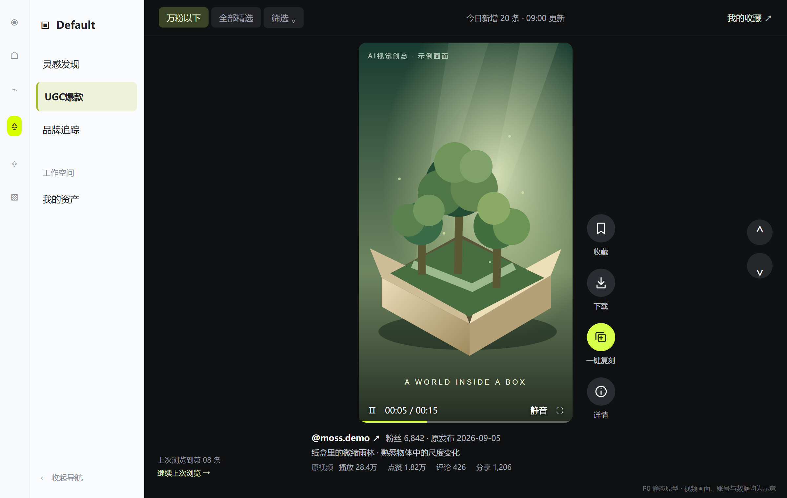

## 进入即刷

- 左侧顺序固定为“灵感发现 → UGC爆款 → 品牌追踪”，选中UGC爆款。点击后直接展示并尝试播放当前条件下的首条视频，不先进入列表，不要求点击“开始刷”。
- 首次及重新进入默认万粉以下、全部品类、原发布日期全部、精选顺序；主动继续上次浏览时按F03恢复。平台固定TikTok。
- 主舞台使用深色背景，单条视频居中等比展示。桌面基准画面中竖屏视频高度占可用舞台高度至少80%；不为铺满裁掉内容，横屏视频完整显示并允许留黑边。
- 左侧保留现有导航和折叠入口。顶部只保留粉丝范围、筛选入口、实际更新提示及“我的收藏”；不设置大标题区、统计卡片区或多列视频区。
- 视频右侧竖排提供本产品收藏、下载、一键复刻、详情；上一条／下一条按钮位于舞台右侧。操作条靠近视频，不覆盖画面中心或源视频字幕。
- 视频下缘外围显示作者、精确粉丝数、原发布日期与简短文案；播放、点赞、评论、分享用紧凑信息展示。详情侧栏默认收起，随时可展开。

## 首屏状态

加载时保留舞台和视频占位，等待真实可播放画面。自动播放未成功时显示“点击播放”；无内容时在同一舞台显示空状态。点击“我的收藏”进入“我的资产 → 收藏”。

示例中的内容画面为示意素材。借鉴参考截图的视觉重心和刷动方式；页面标识、导航和收藏行为使用本产品规则。

验收重点：打开菜单即可观看；一屏一个主要视频；首屏无视频网格；导航可见且可折叠；视频、操作与数据对应同一素材。

<!-- page -->

# F02 紧凑筛选与排序

优先级 P0 · 使用者 已登录客户

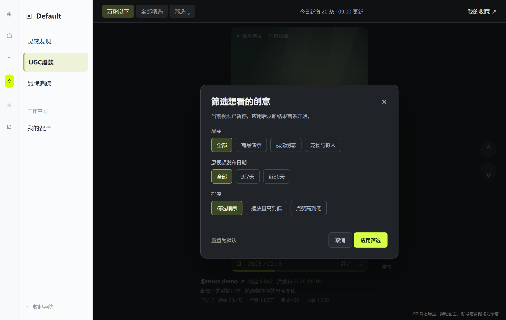

## 选项与默认

| 维度 | 选项与默认 | 行为 |
|---|---|---|
| 作者粉丝 | 万粉以下／全部精选；默认万粉以下 | 顶部直接切换；全部精选不设粉丝上限，仍仅含审核通过AI内容 |
| 品类 | 全部及运营维护的品类；默认全部 | 筛选浮层中单选，包含商品与AI创意类目 |
| 原视频发布日期 | 全部／近7天／近30天；默认全部 | 按原发布日期，北京时间，包含今天 |
| 排序 | 精选顺序／播放量高到低／点赞高到低 | 默认精选；缺值排末尾，同值沿用精选顺序 |
| 重置 | 恢复全部默认条件 | 点击应用后生效，不清除收藏和项目 |

## 应用与恢复

点击“筛选”打开紧凑浮层并暂停视频；浮层内修改不会立即换片。“应用”一次性生效并从新结果首条播放，“取消”或关闭则保留原条件、原视频及打开前播放状态。应用相同条件仅关闭浮层，不重置位置。

顶部切换粉丝范围立即应用，停止旧视频并进入新结果首条。当前条件显示为紧凑摘要；无结果仍留在舞台，可切换全部精选或重置，不静默放宽条件。

同一次浏览保留选择；从详情或创作返回仍恢复原条件。重新通过菜单进入采用默认条件；主动“继续上次浏览”才恢复上次条件与位置。收藏栏目不受公共流默认粉丝范围限制。

不同维度同时满足。近7天指今天及前6个自然日；视频指标仍是最新可用累计数值。使用当前浏览版本的排序数据，后台更新不随意改变已在刷的顺序。

验收重点：9,999与10,000判定正确；取消筛选不换片；应用后信息与视频同时更新；无结果不改成列表或自动解除限制。

<!-- page -->

# F03 上下切换与浏览进度

优先级 P0 · 使用者 日常学习和选素材的运营人员

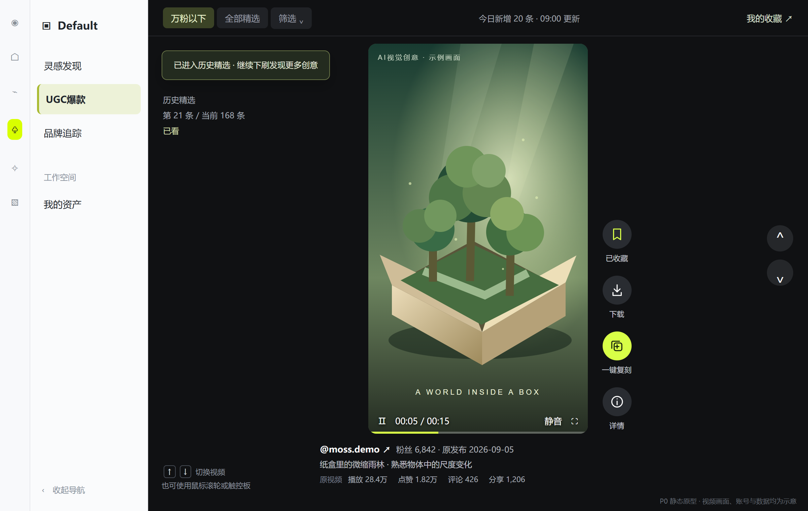

## 连续观看

- 在舞台内向下滚动鼠标滚轮或触控板、按↓、点击下一条，切至后一个视频；反向操作切至前一个。每次明确切换意图只前进或后退一条，避免触控板惯性连跳。
- 切换后旧视频立即停止，新视频从头播放；前后切换都不恢复视频内秒数。首条的上一条不可用。加载失败停留失败状态，由用户重试或下刷跳过。
- 首次播放默认静音，用户可开启声音；本次浏览沿用声音选择。点击画面或空格播放／暂停，控制条支持音量、进度与全屏。自动播放未成功时提供播放按钮。
- 当前视频自然播完后从头循环，保持当前条目；只有用户主动下刷才切换。手动暂停时不自动恢复；离开页面或切到后台暂停，回来由用户继续播放。

## 进度与公共内容

保存最后主动停留的视频、当时筛选和所在序列，跟随登录用户。默认进入最新首条，并以轻提示提供“继续上次浏览”；点击后恢复原条件和位置，不要求恢复到某一秒。

当今日最后一条继续下刷，直接进入历史精选，短暂提示后消失；不插入需要点击的阻断页。全部看完再下刷才显示终点，支持回上一条、回到最新或查看收藏。新批次仅提示“有新精选”，用户主动加载才从最新首条开始。

“已看”按同用户、视频、自然日累计前台实际播放达到min（5秒，时长）判定，循环和回看不重复增加当天有效观看条数。已看提示不改变公共顺序。上次视频已下架或过期时提示，并从原位置后第一条可用内容继续；无后续则回到当前条件最新。

验收重点：一屏一条、一次切换一步、只有当前视频发声；刷40条与刷10条的用户深度不同，仍共享同一内容池。

<!-- page -->

# 沉浸式交互统一规则

本页约束F01至F08共同体验，避免各入口对播放、切换和返回采取不同规则。原型中的界面文案可由设计在不改变含义的前提下精简。

## 页面布局与视觉重心

桌面首版以1366×768和1920×1080验证。默认收起详情，主视频在剩余舞台居中；竖屏视频高度至少占可用舞台80%，画面等比完整显示。工具、计数、作者和文案占用固定外围区域，不遮住原视频字幕。横屏视频优先完整展示，可留黑边，不强行拉伸成竖屏。

左侧导航支持折叠；顶部筛选常驻但紧凑。鼠标移开后播放控件可淡出，移动回来可恢复；收藏、下载、一键复刻仍容易找到。全屏仅放大当前视频，不新增信息流队列，退出恢复原页面状态。

## 播放、浮层与焦点

| 用户操作 | 播放行为 | 切换与返回 |
|---|---|---|
| 打开并排详情侧栏 | 原视频继续，已暂停则保持暂停 | 舞台仍可上下切换；新视频数据同步更新 |
| 打开筛选、反馈或叠层详情 | 暂停并保留打开前状态 | 浮层内不切片；取消／关闭后按原状态恢复 |
| 收藏或下载 | 继续原播放状态 | 轻提示不抢焦点，下刷后结果仍指向原操作视频 |
| 跳入一键复刻／我的收藏 | 离开时暂停 | 返回恢复视频和界面位置，由用户手动继续播放 |
| 外部链接或切到后台 | 页面失去前台时暂停 | 回来保持暂停，用户手动继续 |
| 拖动播放进度 | 只改变当前视频进度 | 不触发上下切片，不把拖至结尾当完整观看 |

仅当焦点位于舞台、没有模态浮层且未在输入控件时，↑↓与空格执行切换和播放。侧栏滚动只滚动侧栏；其边缘继续滚动也不穿透到主视频。用户可使用清晰的上下按钮，无需依赖手势。

## 连续性与例外

同一次滚轮或触控板连续惯性动作只触发一次切换，手势结束后再次主动滚动才切下一条；切换未完成时不积压多次意图。不设置按观看时长解锁下一条的等待要求。

切换时画面、作者、计数与各按钮对象一起更新；加载中的下一条不沿用上一条作者信息。加载失败由用户重试或跳过，不能自动连续跳过大量内容。当前素材被下架则立即停止播放并留在不可用状态，供用户决定下一步。

粉丝资格失效但内容仍可用时，当前条立即取消“万粉以下”标记并提示“该作者已不符合当前筛选”；允许看完当前条，不再作为该筛选的下一条候选；下次恢复时跳至可用位置。作者增长与问题下架分别处理。

<!-- page -->

# F04 按需展开详情与外部链接

优先级 P0 · 使用者 判断参考价值的用户

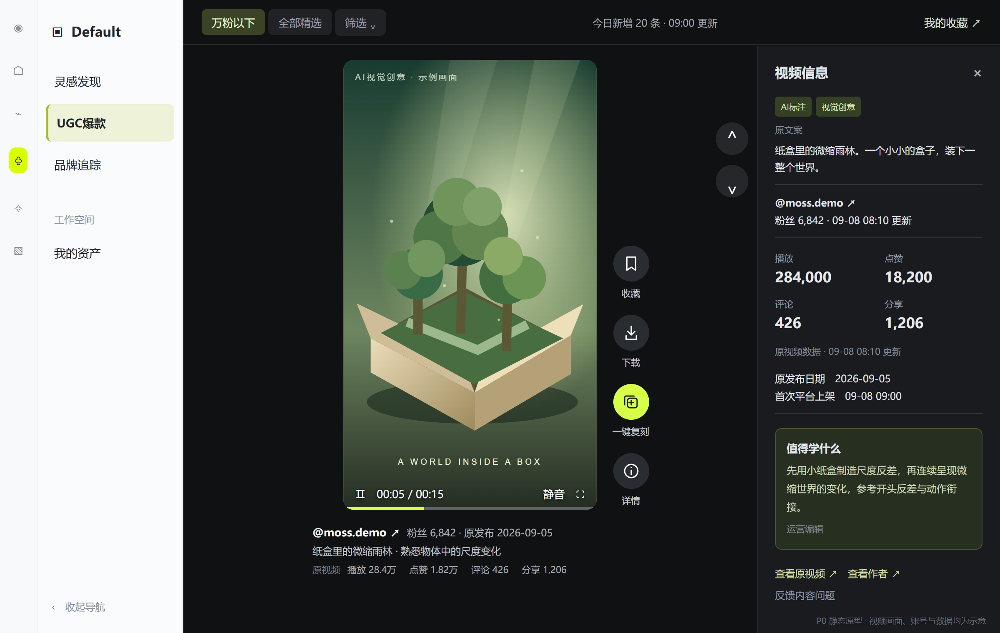

## 默认轻信息，展开看完整资料

- 默认围绕视频展示作者、精确粉丝数、原发布日期、简短文案与播放／点赞／评论／分享四项计数；计数标明来自原视频，仅供阅读，不是本产品点赞或评论入口。
- 点击“详情”在右侧展开“视频信息／值得学什么”侧栏。视频等比调整后仍为主视觉，详情不跳转到独立列表页。关闭后恢复原舞台大小与播放进度。
- 侧栏显示完整原文案、作者与粉丝快照时间、四项完整数值、原发布日期、首次平台上架日期、数据更新时间、AI依据和品类标签。缺失计数显示“—”；来源整体不支持时可隐藏该项并说明，不填0。
- “值得学什么”为运营撰写的20至60字，说明具体开头、动作、演示或节奏，并保留人工编辑来源。不得把人工判断AI标成官方认证，也不承诺复刻后成为爆款。
- 展开侧栏时允许继续看当前视频；侧栏内部滚动只滚动文字。在仍容纳完整视频的桌面布局中可继续用上下按钮切片，侧栏同步下一条信息并回到顶部。

## 链接与动作

作者名称或“查看作者”打开对应TikTok主页；“查看原视频”打开对应发布页，保留本产品位置。链接缺失或已知失效时禁用并说明，不替换为推荐账号首页。

收藏、下载、一键复刻仍在视频旁随时可用；侧栏不承担这些动作的唯一入口。收藏状态来自本产品，不改变TikTok的点赞、收藏或关注数。来源计数与本产品收藏按钮视觉分组，避免误解。

空间不足时侧栏改为叠层并暂停视频，关闭后恢复打开前状态；任何操作不得被遮住。原视频字幕优先，长文案在侧栏查看，不用长文本盖住画面。

验收重点：详情关闭时即可刷视频和创作；展开后数据准确且视频可看；关闭不重播；所有外链与当前视频一致。

<!-- page -->

# F05 收藏到我的资产

优先级 P0 · 使用者 保存参考素材的用户

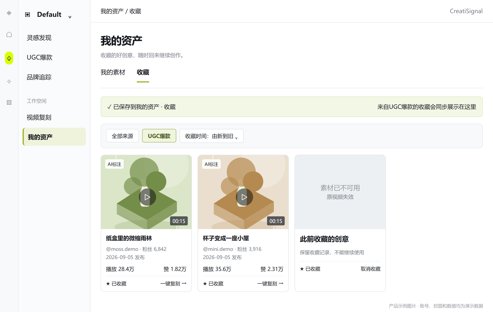

## 收藏和查找

- 在沉浸式视频操作条或详情中点击收藏，成功后显示“已保存到我的资产 · 收藏”，按钮变为“已收藏”；提示中提供“查看收藏”。
- “查看收藏”打开“我的资产 → 收藏”栏目。沿用现有栏目，增加UGC爆款来源识别和筛选，不新建独立收藏库。
- 收藏后保持当前播放状态，成功提示短暂出现，不弹出阻断对话框。收藏项保存视频引用、封面、标题、作者、收藏时间及最近可用的表现资料。收藏后与原视频保持关联，不在前台把同一条视频重复生成多个收藏项。
- 收藏按当前登录用户保存，首版不自动共享给同组织其他成员；若现有资产权限与该约定不同，需要在评审时统一，避免默认公开个人收藏。
- 收藏栏目继续沿用资产管理布局。点击UGC素材进入单条沉浸式预览，可查看原视频、作者、下载和一键复刻；返回后恢复收藏栏目原位置。该预览首版仅展示选中素材，不显示公共流的上下切换入口；收藏栏目按收藏时间由新到旧排列。作者后来涨粉超1万仍保留收藏。

## 取消和保留

任一入口取消收藏后，其他入口同步恢复未收藏状态。取消收藏只移除收藏关系，不删除公共池视频、本地已下载文件、已创建项目或已生成结果。保存失败时保留未收藏状态并提示重试，不能先提示成功。

因公共池90天到期而归档的内容仍可从收藏查看；来源和可用性有效时继续预览和复刻。因原视频删除、下架处置等不可继续使用时，保留“素材已不可用”的记录，禁用受影响动作并允许取消收藏；不能静默替换成另一条素材。

## 验收重点

收藏确实出现在“我的资产 → 收藏”；重复点击只产生一项；跨设备状态一致；取消收藏同步；不同用户隔离；公共过期和不可用状态区分正确。

<!-- page -->

# F06 下载素材

优先级 P0 · 使用者 需要本地分析或参考视频的用户

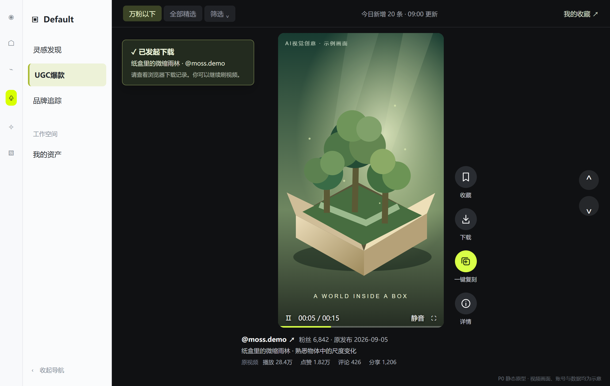

## 可用条件与操作

沉浸式视频操作条、详情和我的资产收藏均提供下载入口。可下载性由实际可用的视频文件与平台确认的使用范围决定，不能把原视频发布页、封面或播放成功当成可下载文件。

点击可下载视频后开始准备，显示“准备下载”；文件可交付给浏览器时提示“已发起下载，请查看浏览器下载记录”。首版不承诺去水印、超清升级或提供来源未提供的画质。

建议文件名包含作者、视频标识和下载日期，便于整理。文件必须是该条可播放的视频，不能是网页文件或错误页。下载不自动产生新收藏，也不创建复刻项目。

下载准备通过视频旁按钮状态和轻提示反馈，不遮挡画面、不主动暂停播放；用户可继续下刷。结果提示明确对应原先点击的视频，不把旧视频的下载结果归到新视频。

## 失败和不可用

- 同一视频的下载准备期间禁用该视频的重复下载点击；准备完成后恢复。再次点击可以主动重新下载。
- 视频文件暂不可用、来源限制下载、素材下架或账号无权限时，显示具体原因，提供重试或查看原视频中实际可用的动作。
- 下载失败不会丢失观看进度和收藏状态。素材可以处于“可预览但不可下载”的状态，其他可用功能继续提供。
- 只有发生可核实的下载完成时才能记录“下载完成”；若产品仅能确认交付浏览器，则记录“下载已发起”，报表不得把它表述为用户本地保存成功。

## 验收重点

按钮状态和真实能力一致；下载得到正确视频；准备阶段重复点击不产生多项准备任务；失败可理解且可恢复；收藏入口与UGC入口规则一致。

下载能力为P0交付项，上线前必须用真实样本打通。若实际来源不能支持，需明确缩减首发范围和对外说明，不能只展示一个不可用按钮作为完成。

<!-- page -->

# F07 一键复刻

优先级 P0 · 使用者 从灵感进入创作的用户

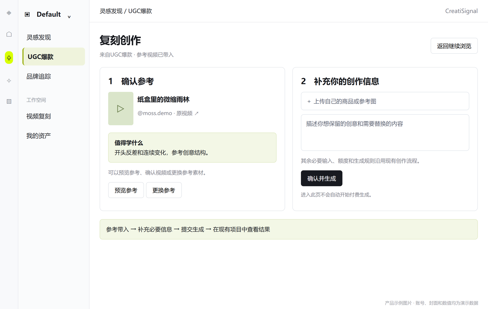

## 点击后发生什么

从沉浸式视频操作条、详情或收藏点击“一键复刻”，进入现有复刻创作流程，自动带入当前参考视频、标题、作者、原视频链接和来源“UGC爆款”。保留用户从哪个位置进入，离开时暂停视频，返回时恢复同一视频、筛选、顺序与详情开合状态，再由用户继续播放。

“一键”指免去重新寻找、下载和上传参考的步骤。若生成仍需要用户商品、参考图、文案或其他必要输入，沿用现有创作页要求，清楚提示用户补充；不会因为点击入口立即开始付费生成。

## 必须承接的体验

- 首屏明确显示“参考视频已带入”，可预览确认是刚刚选中的视频，并显示“值得学什么”作为创作参考。
- 创作前可替换参考或更换自己的商品素材。可复刻范围遵循现有产品支持能力，不保证完整复制原人物、音色和画面细节。
- 用户确认并提交后，沿用现有费用和额度提示，进入项目任务状态。正在跳转或创建期间防止重复点击创建重复项目。
- 创建失败时保留所选参考和已填内容，提供重试；参考不可用时说明原因，允许返回选择其他视频，不静默换素材。
- 生成结果仍保存在现有项目或资产结果位置，并可识别其源自哪条UGC参考；生成失败不会影响原素材的收藏和浏览记录。

## 验收重点

带入的是可消费的真实参考视频，不只是封面或标题；现有流程能完成至少一次生成；原视频与新项目关联准确；返回位置可恢复；入口点击、参考带入、提交生成和结果成功可以分别统计。

正式上线前用代表性真实素材确认支持的时长、画幅、声音与参考类型，并反映到不可用提示。本文不新增模型选择、价格或未经验证的生成能力承诺。

<!-- page -->

# F08 异常状态与内容反馈

优先级 P0 · 使用者 客户与平台运营

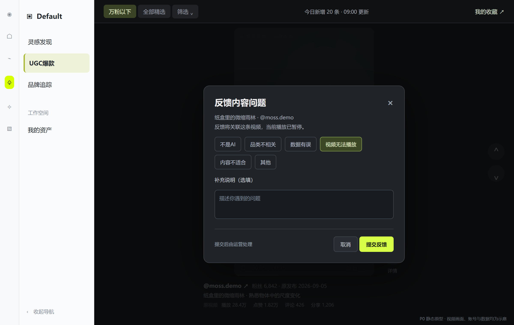

## 用户可见状态

| 状态 | 用户看到什么 | 可继续做什么 |
|---|---|---|
| 没有匹配结果 | 当前筛选暂无内容，保留当前条件 | 切换全部精选或重置 |
| 今日无新增 | 今日暂无新精选，最近更新为实际时间 | 继续看历史精选 |
| 视频加载失败 | 封面与文字保留，显示重试提示 | 重试、下一条、可用的原视频入口 |
| 数据缺失或过期 | 对应指标“—”或实际快照时间 | 使用其他已确认信息，不自动放宽粉丝条件 |
| 已下架或来源失效 | 当前舞台显示暂不可用及简短原因 | 公共流可下一条；收藏预览可返回收藏或移除记录 |
| 全部看完 | 已看完当前条件下的内容 | 回到最新、调整筛选、查看收藏 |

## 反馈入口

每条视频在详情中提供“反馈内容问题”。可选：不是AI、品类不相关、数据有误、视频无法播放、内容不适合、其他；允许补充一句说明。提交后提示已收到，不承诺即时修复。

打开反馈浮层暂停当前视频并固定反馈对象，关闭后恢复之前状态；浮层内部滚动、输入不切片。反馈关联打开时的视频，后台进入待处理队列。相同用户对同一视频同一问题的未处理反馈合并，避免重复堆积。反馈本身不改变公共推荐顺序，也不直接下架；运营处理后更新相应素材状态。

## 状态一致性

素材下架后不再被新浏览加载，已打开素材立即停止播放并显示不可用状态，禁用受影响功能；用户尝试操作时得到明确状态。已生成的独立结果不随参考视频自动删除。收藏与项目里不得继续展示“可用”按钮而实际无法操作。

验收重点：空结果、断更、播放失败、来源失效、全量看完的文案不同；反馈能在后台定位到正确视频；不通过重复刷、重试或刷新制造新增内容。

<!-- page -->

# B01 候选池与每日概览

优先级 P0 · 使用者 内容运营与内容采集负责人

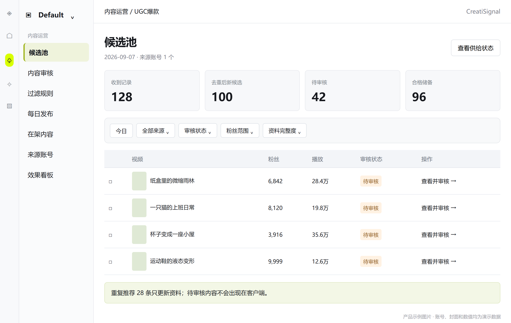

## 候选池应展示什么

按日期查看当日内容供给，分别展示收到记录数、去重后新增候选数、重复数、待审核数、待复核数、审核通过数、今日上架数和可用储备。收到100次推荐不代表新增100条视频。

候选行展示封面、标题、原视频作者、粉丝及快照时间、播放与互动、原发布日期、首次发现时间、来源账号、AI初判状态、播放／下载／复刻参考可用性和审核状态。

推荐内容先进入候选池，不直接推给客户。采集负责人需交付能定位原视频与作者的资料，缺失项标记为缺失，不用相似视频或其他日期的数据补齐。

## 列表操作

支持按日期、来源账号、审核状态、粉丝范围、品类、数据完整度和可用性筛选；支持通过标题、作者或原视频链接查找。点击进入单条审核，支持勾选后进入批量操作。

同一原视频重复出现时合并为已有记录，补充最后发现时间和新数据；不重新进入每日新增，不再次生成收藏素材。相同创意但不同发布账号的视频保留为独立候选，运营可判断是否内容重复并排除。

## 缺失处理

缺原视频身份、作者身份、发布日期或可播放参考时不得普通上架。表现至少有一项满足常规门槛；编辑精选例外仍须有可核实的表现数据，不允许完全没有数据却称为爆款。粉丝无法核验时，只能考虑全部精选。

验收重点：日报数字能解释每条内容去了哪里；重复不会增加新增量；审核未通过的内容在客户端不可见；缺失信息不会被伪造为0或今日时间。

<!-- page -->

# B02 单条审核与学习看点

优先级 P0 · 使用者 内容运营

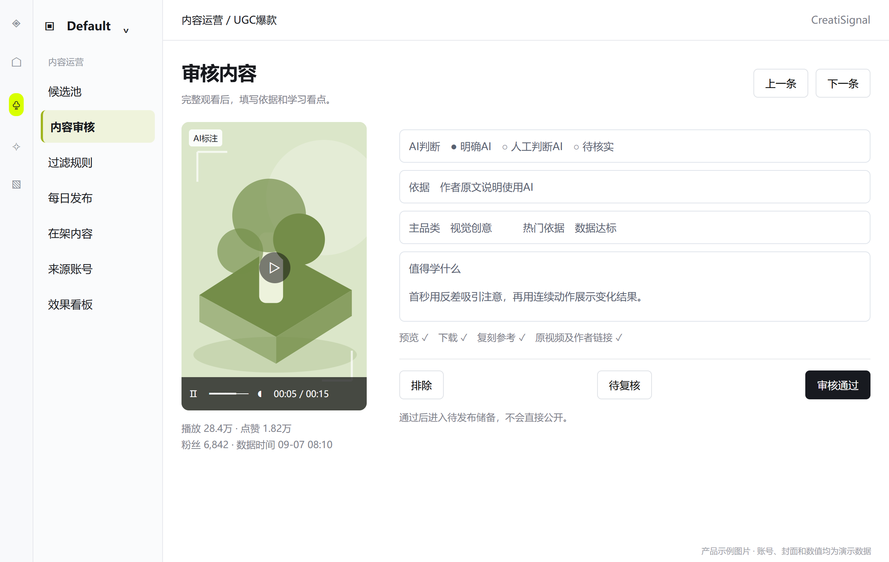

## 审核顺序

运营打开视频后按顺序完成：完整观看 → 判断AI依据 → 判断相关性 → 核对作者和数据 → 确认预览、下载及复刻参考可用性 → 选择品类 → 填写学习看点 → 给出结论。

## 必填内容

| 内容 | 要求 |
|---|---|
| AI结论与依据 | 明确AI／人工判断AI／待核实／非AI；记录对应依据 |
| 品类 | 一个主要品类；不适用商品分类时选AI剧情、视觉创意等实际适用类目 |
| 热门依据 | 数据达标或编辑精选；例外需要主管和具体理由 |
| 值得学什么 | 20至60字，指出可观察、可借鉴的具体创意做法 |
| 可用性 | 分别确认预览、下载、一键复刻参考和外链；不能合并为一个“全部可用”推断 |
| 审核结论 | 通过／排除／待复核；排除与待复核必须填写原因 |

推荐看点示例：“首秒先给出不符合日常经验的变化，再用连续动作展示结果，适合参考其开头反差和动作衔接。”避免“很火、值得学习”“使用某模型必出同款”等无法指导行动的文案。

## 操作结果

通过仅进入待发布储备，不立即公开。排除内容保留记录和原因，避免下次又被推荐后重复审核。待复核内容可由其他运营或主管接手。提交失败保留已填内容；返回列表可继续下一条。

审核通过后修改标题包装、品类或看点应保留修改记录。原作者、原发布日期和真实指标不可任意编辑成更好看的数字；有误时标记并请求复核。

验收重点：漏填AI依据或看点不能普通通过；未达门槛不能被普通审核员当作数据达标放行；通过后客户仍不可见，直到发布完成。

<!-- page -->

# B03 筛选排除与批量操作

优先级 P0 · 使用者 内容运营与主管

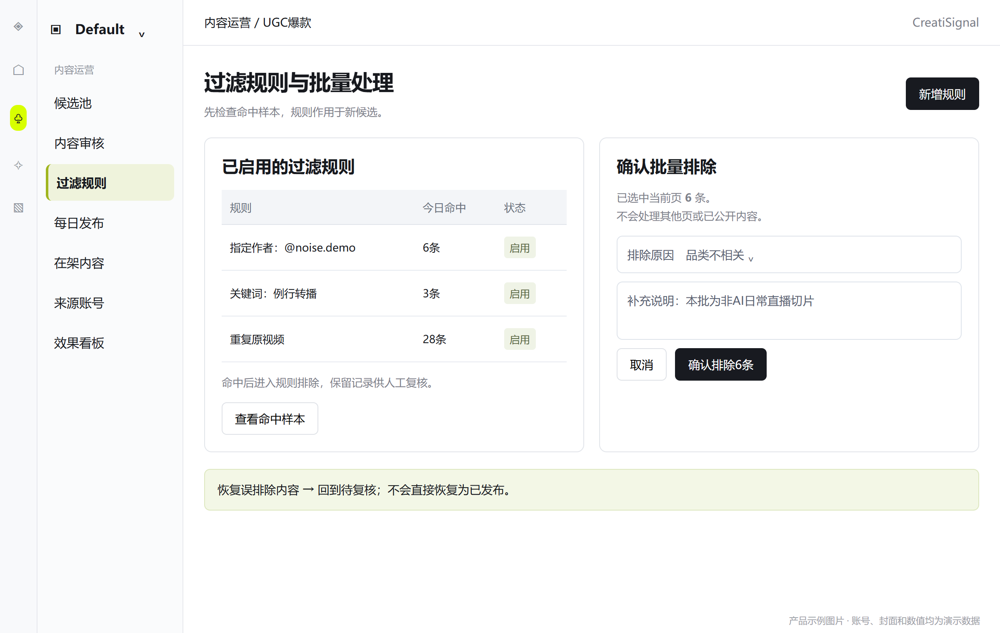

## 减少误推干扰

提供可维护的排除规则：指定作者、标题或文案关键词、重复内容、明确不需要的品类。规则可启用、停用，填写原因，显示命中数量，并查看命中的具体视频。

规则默认作用于新候选；命中后进入“规则排除”区域，可人工复核，不直接删除原始记录。修改规则不会自动下架已公开内容；若需处理历史内容，先展示受影响清单，由主管单独确认。

关键词只作为初筛依据，不替代对视频内容的判断。短词或通用词可能误伤，新增规则时提供样本预览，确认后生效。万粉以下是前台默认筛选，不作为整个内容池的排除规则。

## 批量操作

- 勾选后明确显示选中数量与操作范围；默认只选当前页。选择全部筛选结果必须再次明确范围和数量。
- 支持批量排除、批量移至待复核、批量指定品类和批量通过。批量通过仅限每条已完成必填审核、具备有效依据的记录；不能跳过观看与审核。
- 排除必须选择原因，支持误推不相关、非AI、重复、质量不合格、数据无法核实等；原视频失效按不可用原因记录。
- 批量提交前展示目标状态和数量；完成后分别反馈成功、失败及未处理数量。部分失败可以只重试失败项。
- 排除和黑名单支持恢复到待复核，不直接恢复为公开可用。规则操作记录操作者、时间、理由和影响范围。

## 验收重点

规则能屏蔽用户提到的偶发不相关推荐；正常素材可以从规则排除中恢复；批量操作不越过选择范围；黑名单作者不会因换了昵称而漏处理，昵称只是展示信息。

<!-- page -->

# B04 每日编排与发布

优先级 P0 · 使用者 发布运营与主管

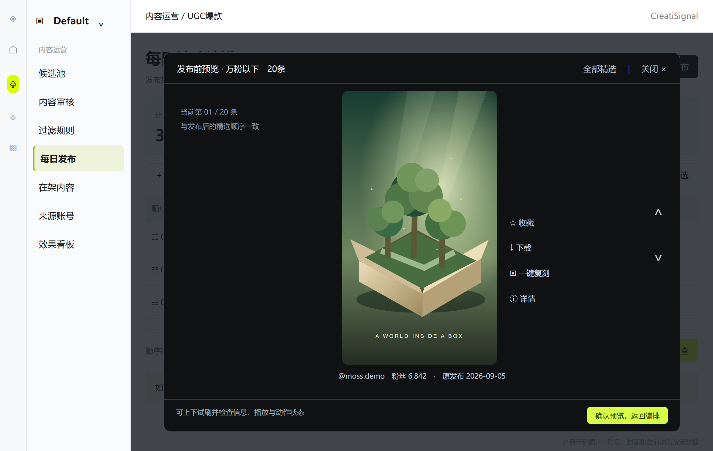

## 从储备到今日精选

从审核通过且未首次公开的储备中选择内容，组成本次发布批次。展示总数、有效万粉以下数量、各品类分布、数据待更新数和不可用数。默认目标30条、其中万粉以下20条，目标不足不自动降低质量要求。

运营可以调整批次内顺序、移出视频、补入储备、查看每条审核依据。建议同一作者每批不超过3条、单一品类不超过40%；这是初始编辑提醒，主管可说明理由后继续，不是阻断正常发布的隐藏规则。

## 发布前检查与预览

- 逐条检查审核状态、必要字段、预览可用性、重复上架、粉丝资格以及下载和复刻可用状态；失效或审核未通过的条目不得发布。
- 提供“预览万粉以下”和“预览全部精选”，使用与客户一致的单条沉浸式预览，展示数量与真实顺序；可上下试刷，检查竖屏／横屏、详情、动作可用状态，不以后台表格代替预览；万粉以下数量按有效粉丝快照计算。
- 支持立即发布或预约时间。发布前显示日期、实际数量、万粉以下数量和未达目标的原因。预约发布时仍需重新检查内容有效性。
- 预约后允许在截止前撤销预约并回到草稿；修改内容或顺序后必须重新预览和提交。预约不会让客户提前访问。

## 发布结果

发布成功后同一批次完整可见，记录实际发布时间；失败则该批次维持未公开并提示处理，不出现客户只看见部分新批次而后台显示全部成功。合格内容不足可主动减少批次再提交。

发布后的批次顺序固定，不随数据刷新重排。移除问题视频按下架处理；恢复历史视频不重置首次上架日，不重复增加今日新增。全局紧急修正应通知后台相关人员并记录原因。

验收重点：预览与实际一致；未达数量可以明确少量发布；预约时有二次有效性检查；一次发布不会生成重复批次或重复视频。

<!-- page -->

# B05 在架维护与反馈处置

优先级 P0 · 使用者 内容运营与主管

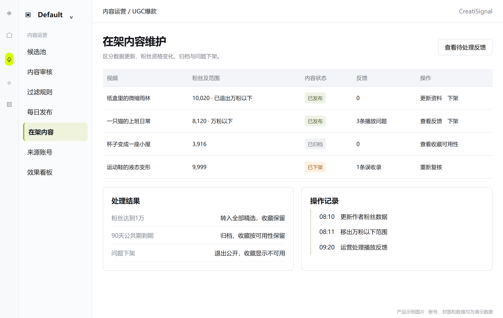

## 日常维护

支持查看已发布视频的当前资料、实际数据时间、粉丝资格、功能可用性、累计用户反馈和上架历史。数据更新成功后使用新值，并保留更新时间；更新失败保留旧值并显示已过期，不写成0。

作者粉丝达到1万时，自动退出万粉以下范围，仍保留在全部精选。粉丝数据超过有效窗口时，不继续展示“万粉以下”资格，待更新后重新判断。该规则不删除个人收藏。

## 反馈处理

内容反馈进入待处理列表，运营可查看原因、相关视频和用户补充。处理结论包括修正标签或看点、请求数据更新、临时下架、确认无问题；每条结论保留说明和处理时间。相同视频的问题可合并处理，原反馈仍可追溯。

## 下架与恢复

- 下架必须填写原因：误收录、不相关、原视频失效、重复、投诉或其他。普通运营可紧急下架；恢复发布由主管确认。
- 下架立即影响公共内容流、已打开视频、详情和收藏内的可用动作；收藏保留不可用记录。已下载的本地文件和已生成独立结果不自动删除。
- 恢复前重新检查AI依据、原链接、视频可用性和粉丝数据。恢复回原历史批次位置；不标为今日新增，不重置90天公共期。
- 90天公共期到期属于归档，不是问题下架；个人收藏仍按可用性规则保留。已归档内容若要再次精选曝光，应单独评审后续专题能力，本期不通过重新入库绕过规则。

## 验收重点

后台修改能准确反映到用户界面；下架与归档效果不同；涨粉不会清除收藏；每次状态变化能回答“谁、何时、因何原因处理”。

<!-- page -->

# B06 来源账号与供给状态

优先级 P0 · 使用者 内容采集负责人和运营主管

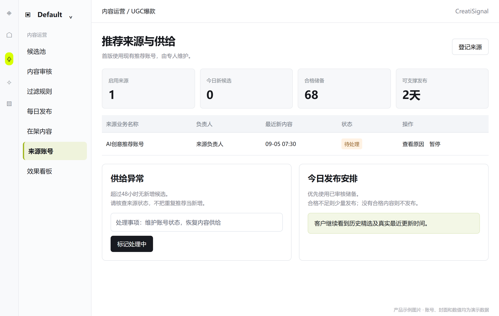

## 来源信息

登记现有推荐账号的业务名称、账号负责人、重点内容方向、主要语言或市场、启用状态、最近收到新内容的时间和当日新增候选量。首版启用一个现有账号，多账号运营策略后续再扩展。

账号登录维护和日常养号由指定负责人承担；后台无需向普通客户或审核人员展示登录凭据。客户浏览产品内视频，不要求客户登录该TikTok账号，也不能操作该公共账号。

## 供给健康

显示正常、暂停、待处理三个业务状态。可以区分“来源未提供新内容”“来源登录需维护”“内容已收到但重复较多”“新内容存在但多数审核不合格”。不能把这些情况统一显示为成功或无数据。

建议超过24小时无新增候选提示关注，超过48小时标记供给异常；由后台可见的提示和负责人待办承接，通知方式在评审时确认。状态根据真实结果判断，不用定时任务启动次数代表供给正常。

## 断更处置

1. 当日新候选不足，先使用已审核未发布储备；原视频日期照常展示，不把旧视频日期改成今天。
2. 储备不足，按实际合格数量发布，并记录少发原因；完全无合格内容时保留历史池和实际最近更新时间。
3. 运营联系账号负责人恢复供给，必要时暂停来源；恢复后先去重再进入候选池，不把补到的重复记录算新增。
4. 所有客户看到的更新提示基于真实发布结果，不能因为后台尝试获取新内容就显示“今日已更新”。

验收重点：来源断更时用户仍能浏览历史；后台能定位是供给、审核还是发布问题；恢复不会重复入库；公共账号不因客户操作发生点赞、关注或收藏变化。

<!-- page -->

# B07 内容与用户效果看板

优先级 P0 · 使用者 产品负责人和运营主管

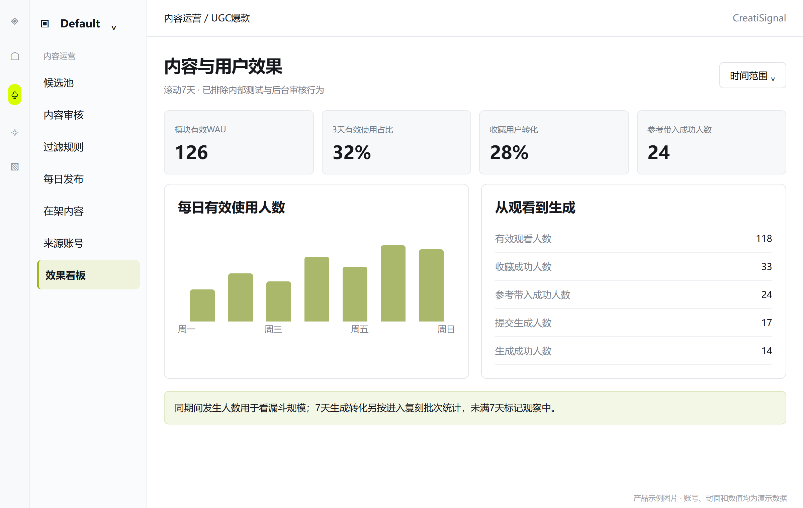

## 看板范围

按日、自然周和滚动7天查看，支持试点批次、内容批次和万粉以下／全部精选拆分。默认排除内部测试账号、运营后台行为和非真实用户活动。所有比率显示分子、分母和时间范围。

## 四组核心信息

- 供给：去重候选数、审核通过率、实际上架数、万粉以下占比、储备天数、连续未更新天数。
- 质量：AI相关性抽检通过率、不相关反馈率、不可播放率、数据缺失率、可下载与可复刻占比。
- 使用：模块访问人数、模块有效WAU、平台有效WAU、周内至少3天有效使用人数占比、每用户有效观看条数的中位数、首次播放成功率、上下切换后的播放成功率。
- 行动：收藏人数和收藏视频数、从我的资产收藏回访人数、下载已发起人数、参考成功带入人数、提交生成人数和生成成功人数。

## 内容层查看

每条视频可查看信息流曝光、有效观看、主动切换、详情展开、收藏和复刻等结果，用于改进选题。单纯播放高不能直接获得更多推荐位置；调整精选顺序仍通过运营编排。不得显示无法核实的用户本地下载完成量或把复刻点击量称为生成量。

## 操作结果

看板能够定位“候选很多但审核不过”“新增稳定但用户不回访”“观看多但没有收藏”“收藏后未进入创作”“进入创作但生成失败”等不同问题。首版提供汇总和基本明细，不扩展为通用分析平台。

验收重点：看板数字可回查到对应用户行为或内容记录；用户操作失败不计成功；公共池复用不会造成同一用户重复计入WAU；运营的审核播放不抬高客户观看指标。

<!-- page -->

# 内容采集交付要求

本节供内容采集、产品与运营确认业务资料是否完整。字段名称仅描述含义，不规定接口、存储方式或采集方案。

## 每条视频的必要信息

| 信息 | 业务要求 | 缺失时 |
|---|---|---|
| 原视频身份与发布页 | 能稳定辨认同一原视频并打开其发布页 | 不得上架，不可用标题猜测匹配 |
| 作者身份与主页 | 视频作者的名称、稳定身份及主页链接 | 待补全，不以推荐账号当原作者 |
| 标题或原文案 | 保留原文，支持长文案；允许本身无文案 | 标“暂无文案”，不可伪造作者原文 |
| 原发布日期 | 原视频实际发布日期，能区分日期与时间精度 | 未核实前不得普通上架 |
| 封面与时长 | 封面对应视频，时长支持观看和筛选解释 | 待补全，不以别的视频封面代替 |
| 视频预览 | 用户能播放正确且完整的原视频参考 | 不得作为可用视频发布 |
| 播放量与点赞 | 来源当前可提供的累计值及各自数据时间 | 至少一项可核实；不允许全无依据 |
| 评论与分享 | 只交付来源实际可得数值 | 不支持则标不支持，个别缺失标缺失 |
| 作者粉丝 | 作者最近有效值及采样时间，尽可能精确 | 不能归入万粉以下；不强制排除全部精选 |
| 来源账号与发现时间 | 哪个公共推荐账号发现、首次及最近发现时间 | 无法追查时退回核对 |

## 另外需要明确的能力

每条视频需分别判断能否预览、是否可交付下载文件、能否作为现有复刻流程参考、原视频和作者链接是否有效。能看到封面不代表能播放；能播放不代表能下载；能下载也不保证能进入复刻。

同一视频再次出现时，提供最新可用资料并识别为重复。资料更新失败或来源只返回模糊数量时，保留“缺失、过期、近似值”的真实含义；不能为了满足产品展示而推测精确值。

研发评审前用30条真实候选做资料与动作验证，覆盖低于1万、达到或超过1万、数据缺失、近似粉丝数、来源失效及重复推荐。把当前可得、可补充、暂不可得三种结果列清楚。

<!-- page -->

# 状态流转与权限边界

## 内容状态

| 当前状态 | 可执行操作 | 对客户是否可见 |
|---|---|---|
| 待审核 | 通过、排除、转待复核 | 否 |
| 待复核 | 补资料后重新审核 | 否 |
| 已排除 | 说明原因后恢复待复核 | 否 |
| 审核通过 | 加入批次、修改审核资料 | 否 |
| 待发布 | 预览、预约、撤回编排、发布 | 否 |
| 已发布 | 更新资料、处理反馈、下架 | 是，受筛选和可用性限制 |
| 已归档 | 维护收藏中的可用性 | 公共池不可见，个人收藏仍保留 |
| 已下架 | 复核、满足条件后恢复原位置 | 公共池不可见，收藏显示不可用记录 |

内容生命周期、粉丝资格、下载可用性和复刻可用性分别判断。例如已发布视频可以因涨粉不再属于万粉以下，但仍属于全部精选；不可下载也不自动表示不可预览。

## 角色与职责

| 角色 | 可以做什么 | 不应默认获得什么 |
|---|---|---|
| 客户用户 | 浏览、个人收藏、下载、复刻、反馈 | 后台审核权、公共来源账号操作权、他人收藏 |
| 内容审核运营 | 查看候选、标签与看点审核、排除、紧急下架、处理反馈 | 修改真实指标、无依据例外上架 |
| 发布主管 | 发布与预约、规则维护、例外精选、恢复上架 | 用未核实数据替代真实指标 |
| 来源负责人 | 维护来源账号供给、核对资料缺失、处理断更 | 默认访问客户商品或私有创作内容 |
| 产品负责人 | 查看效果、确认门槛和范围调整 | 在无事实依据时宣称WAU增量由此功能造成 |

首版可由同一成员承担多个运营角色，但操作仍保留姓名、时间、处理前后状态和原因。

## 使用范围确认

上线前由业务负责人确认推荐来源内容在产品内展示、下载及作为生成参考的可用范围，并完成真实样本验证。无法支持的具体动作显示限制，不因为视频公开可见就认定所有动作均已确认可用。此项是上线物料与能力确认，不要求客户每次浏览重复审批。

<!-- page -->

# 数据埋点 用户行为

以下是业务事件口径，不限定技术事件名。事件关联用户、组织、时间、入口、当前视频、内容批次、浏览版本及筛选；无关字段不强行填写。区分公共内容流、收藏单条预览与后台预览，内部审核不计客户活跃。

| 事件 | 触发时机与去重 | 用途 |
|---|---|---|
| 模块访问 | 成功进入UGC爆款，一次访问会话一次；30分钟无操作后再进入算新会话 | 入口触达 |
| 信息流曝光 | 当前视频画面至少50%可见并持续1秒；同会话同视频一次 | 单条曝光到观看；替代卡片曝光 |
| 筛选应用 | 条件实际改变并生效，记录前后条件及结果数；取消不计 | 需求及无结果分析 |
| 播放尝试／开始／失败 | 尝试启动当前视频；真实开始才记开始，失败带原因；区分自动与手动 | 首次播放与切换播放成功率 |
| 有效观看 | 同用户、视频、自然日累计实际前台播放达min（5秒，时长），每天最多一次 | 有效用户、视频数、活跃天数 |
| 观看时长／自然播完 | 扣除暂停、卡顿、后台和完全遮挡时长；拖至末尾不算完整观看 | 真实消费深度，防止挂页抬高 |
| 切换意图／切换完成 | 记录滚轮、触控板、键盘或按钮、前后视频及方向；完成指当前对象真实变化，循环不计 | 切换使用、失败与中断位置 |
| 恢复进度／加载新精选 | 用户主动执行并实际恢复或加载后记录 | 回访与每日新内容使用 |
| 详情展开／关闭 | 记录视频及并排／叠层展开方式；与仅露出紧凑计数区分 | 学习看点使用 |
| 收藏成功／取消 | 状态实际变化后记录，重复点击不重复成功 | 积累与回流 |
| 收藏栏目访问 | 打开我的资产收藏，区分UGC入口与资产入口 | 收藏回访 |
| 原视频／作者点击 | 分别记录；只确认点击，不宣称外部页成功打开 | 深度研究意图 |
| 下载点击／已发起／失败 | 分开记录准备前、交付浏览器及失败；固定原始视频 | 下载需求与可用性 |
| 反馈提交成功 | 后台真实收到，固定打开反馈时的视频 | 内容质量 |

只有当前视频真实播放、页面处于前台、画面至少50%可见且未被模态浮层遮挡时，才累计有效时长。并排详情不遮挡视频时可累计；筛选／反馈等暂停浮层不累计。

自然循环可累计真实时长，并单独标记循环次数；同用户、同视频的完播人数和有效观看人数按日去重。周内独立视频数重新按用户与视频去重，不把循环或每日条数相加当独立视频。页面停留、曝光、自动播放尝试均不能单独抬高有效WAU。

<!-- page -->

# 数据埋点 创作与运营

## 创作链路

| 事件 | 业务成功条件 | 需要关联 |
|---|---|---|
| 一键复刻点击 | 用户主动点击入口 | 当前视频、沉浸式操作条／详情／收藏预览入口 |
| 参考带入成功 | 现有创作页确认该视频可作为参考继续使用 | 来源视频、当前草稿或项目 |
| 参考带入失败 | 无法使用该参考，包含明确失败原因 | 来源视频和当时可用性 |
| 提交生成 | 用户完成必要输入且任务被接受 | 当前项目、来源视频、提交时间 |
| 生成成功／失败 | 任务产生可用结果或明确失败终态 | 项目、来源视频、完成时间与结果状态 |

如果用户替换了参考，UGC来源归因只保留在该视频确实仍参与的创作中；不能因为最初从UGC进入，就把后续使用其他参考的项目继续记给原视频。用户主动创建多个不同项目可分别统计，但重试同一任务不重复计项目。

## 运营行为

| 事件 | 记录内容 | 作用 |
|---|---|---|
| 候选新增／重复发现 | 来源、日期、原视频、结果类别 | 供给量和重复率 |
| 审核提交 | 结论、理由、AI依据、审核人 | 相关性与审核效率 |
| 规则或黑名单调整 | 调整内容、操作者、受影响范围 | 排查误排除 |
| 批次发布／失败 | 批次、实际数量、万粉以下数量、实际时间、原因 | 更新稳定性 |
| 数据更新／失败 | 视频、更新时间、受影响字段状态 | 新鲜度和资格变动 |
| 下架／恢复／归档 | 原状态、新状态、原因、操作者 | 内容质量和状态一致性 |
| 反馈处理 | 问题类型、处理结论、耗时 | 质量改进 |

## 时间与归因

自然日和自然周统一北京时间；自然周为周一至周日，滚动7天为当天及前6天，两者分别命名。实时事件与最终生成结果可以不同日发生，按真实发生时间记录。

生成转化另看“进入复刻后7天内完成”的用户批次口径，以便等待异步结果；未满7天的批次标记观察中。跨日或跨周完成仍能关联原视频，但当周发生统计与批次转化不能混为同一个数。

<!-- page -->

# 指标目标与效果验证

## 指标定义

| 指标 | 计算口径 |
|---|---|
| 平台WAU | 沿用当前平台正式口径，在上线前登记；不为证明新功能有效而修改定义 |
| 平台有效WAU | 7天内发生原有核心有效行为或本模块有效行为的用户并集，按用户去重；作为补充观察，不替换正式WAU |
| 模块访问WAU | 7天内至少一次访问UGC爆款的去重客户用户数 |
| 模块有效WAU | 7天内至少发生一次有效观看、收藏成功或参考带入成功的去重客户用户数 |
| 周内3天有效使用占比 | 同一周至少3个自然日有效使用模块人数／该周模块有效WAU |
| 次周留存 | 本周首次有效使用且下周再次有效使用的人数／本周首次有效使用人数；仅统计观察窗口完整人群 |
| 收藏用户转化 | 周内有效观看用户中同时发生收藏成功的人数／周内有效观看人数；用户去重 |
| 复刻带入转化 | 周内有效观看用户中同时发生参考带入成功的人数／周内有效观看人数；限该模块源视频 |
| 7天生成转化 | 首次带入后7天内生成成功人数／该批次参考带入成功人数；排除观察未满7天批次 |
| 收藏回流 | 从我的资产收藏预览或复刻UGC视频的去重用户数及占收藏用户比例 |

下载已发起是使用意图，首版不单独作为有效WAU的充分条件，避免只点击下载却没有真实内容消费时放大活跃。

## 上线前后的验证方法

上线前保留至少2周平台活跃与创作基线，试点后观察至少4周。按组织分批开放，优先使用同类客户的同期未开放组作对照，记录营销、节假日和其他功能发布影响。只有前后对比时，结果作为相关性证据，不直接声称因果增量。

业务建议目标：试点第4周模块有效WAU占已开放组织中平台有效活跃人数≥25%；周内3天有效使用占比≥30%；次周留存≥30%。这些不是现有成绩，需结合真实基线和样本量在上线前确认。

## 质量护栏与网感验证

供给护栏建议：目标发布量达成天数／计划发布天数≥90%；抽检合格数／抽检总数≥95%；真实播放开始次数／播放尝试次数≥98%。每次重试作为新尝试，同一次尝试不重复计数。每日抽检10条或当日全量不足10条，保持抽样规则不因结果调整。

每周访谈5名试点运营，询问“本周学到什么、收藏为什么、是否用于真实创作”，收集可举例的回答；不得仅凭刷视频时长宣称审美改善。若WAU上升但相关性、收藏或创作无改善，优先调整内容质量和看点。

<!-- page -->

# 每日运营流程与责任

## 上线前准备

来源负责人验证真实供给；内容运营建立初始标签和审核示例，完成100条储备；产品确认下载和复刻可以实际使用；主管确认初始门槛、发布节奏和试点客户名单。

## 每日例行流程

| 时间建议 | 工作 | 负责人 | 产出 |
|---|---|---|---|
| 前一工作日 | 审核候选、补看点、整理次日储备 | 内容运营 | 审核通过的候选集合 |
| 08:30前 | 检查来源状态、数据时间、储备数量和待处理异常 | 来源负责人、运营 | 当日供给与问题清单 |
| 08:30至09:00 | 编排、检查粉丝资格、预览两种筛选范围 | 发布主管 | 确认可发布批次 |
| 09:00 | 预约或立即发布，验证用户可见结果 | 发布主管 | 实际发布数量与时间 |
| 发布后 | 检查进入即播、上下切换、详情、收藏和复刻入口，抽检相关性 | 内容运营 | 抽检结论及处理项 |
| 当日持续 | 处理来源失效、用户反馈、误推和数据错误 | 内容运营、来源负责人 | 修正或下架记录 |
| 每周 | 回顾供给、有效活跃、收藏回流与生成结果 | 产品、运营主管 | 下周内容方向与规则调整 |

上述时间为初始建议，可按照实际工作时段整体调整；周末和节假日应提前安排储备与值班，不默认用户接受断更。

## 例外处置

- 内容不足：减少当天发布量，说明原因，继续补充储备；不能重复视频、放宽AI判断或伪造新数据凑足目标。
- 推荐方向漂移：通过规则隔离不相关候选，由来源负责人维护账号方向；客户端不暴露内部排查过程。
- 误上架：立即下架，检查受影响的公共内容流、已打开视频和收藏动作；复核后才能恢复。
- 来源中断：使用储备维持，后台显示真实异常和可支撑天数；对客户显示实际最近更新，不倒计时承诺未确认的下一次更新。

## 闭环标准

每天都能回答：新增多少独立候选，排除原因是什么，实际发布多少，其中多少符合万粉以下，客户是否能正常使用，以及当日问题由谁处理。运营人数和审核量可根据真实处理时长调整，不用固定候选目标代替质量。

<!-- page -->

# 最小验收清单 用户端

下列P0验收按可重复操作验证，不以页面上出现按钮或示例数据作为完成。

| 编号 | 测试场景 | 必须得到的结果 |
|---|---|---|
| A01 | 查看左侧导航 | 灵感发现下方是UGC爆款，再下方是品牌追踪；无重复入口 |
| A02 | 用户首次进入 | 默认万粉以下、全部品类、原发布日期全部、精选顺序；直接进入首条大视频 |
| A03 | 准备9,999、10,000、粉丝未知、过期四条素材 | 只有有效9,999进入万粉以下；全部精选可展示其他合格项 |
| A04 | 来源只提供10K粉丝 | 不能认定低于1万，展示近似或待确认信息 |
| A05 | 两用户同版本同条件浏览 | 结果与顺序一致，收藏和进度各自独立 |
| A06 | 连续浏览超过当天数量 | 正常进入历史精选，不重复、不要求解锁；全部看完有终点 |
| A07 | 观看中发布新批次 | 当前视频与顺序不中断；提示用户主动加载新内容 |
| A08 | 开启声音后切换视频，再关闭并排详情 | 旧视频暂停，无多条同时发声；回到原位置 |
| A09 | 快速划过与有效播放 | 快划不标已看；达到有效观看门槛后标记，并正确去重 |
| A10 | 查看同一素材紧凑信息和展开详情 | 视频、作者、播放、互动、粉丝、原日期一致；未知不等于0 |
| A11 | 点击原视频与作者链接 | 分别到正确发布页和主页；本产品位置保留 |
| A12 | 收藏后进入我的资产收藏 | 出现同一视频，重复点击不重复新增；其他入口状态一致 |
| A13 | 从我的资产取消收藏 | UGC页面同步未收藏；公共视频和已创建项目保留 |
| A14 | 作者粉丝由9,999更新到10,000 | 退出万粉以下，全部精选及已有收藏仍存在 |
| A15 | 下载成功与失败样本 | 可用样本得到正确文件；失败有原因和重试，不误记完成 |
| A16 | 从各入口一键复刻 | 正确参考自动带入；补充输入后能提交生成并产出结果 |

至少使用两个独立客户用户、一个运营账号和覆盖边界的真实或受控测试素材。测试资料要标识为测试，不混入正式内容池和正式WAU。

<!-- page -->

# 最小验收清单 后台与数据

| 编号 | 测试场景 | 必须得到的结果 |
|---|---|---|
| A17 | 同一视频重复推荐三次 | 仅一个内容记录，新增候选只计一次，后续只更新资料 |
| A18 | 非AI、待核实、缺原链接内容 | 不能通过普通发布进入公共池 |
| A19 | 未达热门门槛申请精选 | 普通运营不能按数据达标通过；主管填写理由后标编辑精选 |
| A20 | 关键词或作者黑名单命中 | 新候选进入规则排除，可复核；不静默下架历史内容 |
| A21 | 批量操作部分失败 | 成功、失败和未处理数量可区分，只重试失败项 |
| A22 | 批次只够12条合格内容 | 可明确发布12条，不填重复、不发布未审核内容 |
| A23 | 定时发布前有视频失效 | 阻止该批次直接发布；处理后重新预览，不假报全部成功 |
| A24 | 发布失败再重试 | 不产生重复批次；同批次不出现部分客户可见状态 |
| A25 | 紧急下架已被收藏的视频 | 公共池退出，收藏保留不可用记录，受影响动作禁用 |
| A26 | 恢复旧视频或90天归档 | 恢复不算今日新增；归档不等于问题下架；收藏规则正确 |
| A27 | 来源48小时无新内容 | 后台显示异常，前台可看历史，最近更新时间保持真实 |
| A28 | 用户反馈不相关视频 | 后台能定位正确素材、去重未处理反馈并留处理结论 |
| A29 | 暂停、卡顿、后台停留、拖到末尾 | 不计有效观看时长或完整观看；内部审核播放不计客户活跃 |
| A30 | 同用户一周多次访问及跨设备 | WAU按用户去重；自然日与自然周使用北京时间 |
| A31 | 点击复刻但带入失败、生成失败 | 分别记录各阶段，不把点击或项目创建当生成成功 |
| A32 | 替换参考后成功生成 | 不错误归因给已移除的原UGC参考；7天批次转化标记观察期 |

## 上线判断

P0用户链路、运营发布链路、最小埋点及A01至A40关键边界均通过后进入试点。下载与一键复刻必须至少有真实可用样本完成端到端验证，不能以灰色按钮或模拟跳转替代。

采集字段、视频展示、下载或复刻范围若存在无法支持项，产品负责人需要更新本需求范围与对外承诺，并由相关负责人确认调整；不得以未经核验的默认值完成验收。

<!-- page -->

# 最小验收清单 沉浸式体验

本页为新增P0验收，与A01至A32一并执行。用真实视频和受控异常验证，不以静态原型通过代替功能完成。

| 编号 | 测试场景 | 必须得到的结果 |
|---|---|---|
| A33 | 两种桌面尺寸首次进入；竖屏、横屏各一条 | 单条视频居中，竖屏高度≥可用舞台80%，等比完整；首屏无卡片网格、分页列表或“开始刷”门槛 |
| A34 | 滚轮、触控板、↑↓、上下按钮分别切换；包含长惯性动作 | 每次明确意图只切一条，切换中不积压；旧视频停止，画面、作者、数据、操作对象一致 |
| A35 | 视频自然播完、循环三次、手动暂停、切后台再返回 | 自然循环当前条而不自动切下一条；暂停及后台返回不擅自播放；有效观看当天只计一次 |
| A36 | 播放中打开详情并滚动长文案；侧栏到边界继续滚动 | 并排详情不打断视频；文字滚动不切主视频；点击上下按钮才切片并同步新资料，关闭保持当前进度 |
| A37 | 打开筛选、反馈浮层、叠层详情；输入及取消；应用新筛选 | 模态期间暂停、键盘不误切；取消恢复原状态；新筛选从新首条开始；相同条件不重置 |
| A38 | 连续下刷跨今日与历史边界，再刷至全部终点；期间有新批次 | 自动衔接历史且提示不阻断；无强制点击加载更多；终点可返回，新批次不插队 |
| A39 | 收藏／发起下载后立刻下刷；从复刻和收藏再返回 | 收藏只改变本产品状态；下载结果对应原视频；返回恢复筛选、视频及侧栏状态，无自动发声 |
| A40 | 当前视频被紧急下架、粉丝越过1万、网络加载失败 | 下架立即停播并禁用动作；涨粉按资格规则提示且保留全部精选与收藏；加载失败可重试或跳过，不无限跳片 |

## 视觉与交互签收

设计与产品逐项确认：视频是首屏最大的信息主体，常用动作不藏在详情里，文本不盖住原字幕，数据与本产品操作能区分。使用鼠标、触控板和键盘都能完成至少10条连续观看。

测试记录每项使用的样本、账号、画面尺寸、实际结果及问题截图。出现裁切主体、多视频发声、手势连跳、浮层穿透切片、收藏错对象或下载错素材时，不通过沉浸式体验验收。

## 版本一致性

客户正式页、运营发布前预览、埋点说明和本文示例图应遵循同一交互规则。后台可以用表格管理内容，客户UGC爆款入口不得回退为传统视频列表页。

<!-- page -->

# 物料准备与评审分工

## 上线物料清单

| 物料 | 数量或要求 | 责任方 | 完成标准 |
|---|---|---|---|
| 推荐来源账号 | 首版1个已有账号，指定维护人 | 业务、来源负责人 | 连续记录真实供给，明确操作责任 |
| 字段与动作验证样本 | 30条，覆盖粉丝与失效等边界 | 内容采集、产品 | 必要资料及预览、下载、复刻逐项有结论 |
| 冷启动内容 | 100条已审核，其中至少60条万粉以下 | 内容运营 | 资料、标签、看点和可用性完整 |
| 审核正反例 | 建议各10条 | 运营主管 | 解释为何通过、排除或待复核 |
| 品类词库 | 商品类目＋适用的AI创意类目 | 产品、运营 | 可区分相关与不相关，不把所有视频强套商品 |
| 热门与AI判断说明 | 门槛、例外规则、AI标签依据 | 产品、运营主管 | 审核人员可以一致使用 |
| 学习看点示例 | 每个主要品类至少3条 | 内容运营 | 具体描述开头、动作、演示或节奏 |
| 体验验证素材 | 竖屏、横屏、长文案、带字幕、静音／有声、失效等各类样本 | 产品、设计、测试 | 1366×768与1920×1080可完整观看并操作 |
| 页面文案与原型 | 本文15张原型及状态文案 | 产品、设计 | 单条沉浸式首屏、交互状态、菜单位置和收藏去向符合本版 |
| 下载与参考使用范围 | 明确可支持的来源与内容 | 业务、产品 | 不把公开可见等同于能力已确认 |
| 试点客户与基线 | 客户组织、使用人员、既有WAU定义 | 产品、客户成功 | 排除内部用户，具备比较窗口 |
| 运营排班与负责人 | 工作日、周末、异常值班 | 运营主管 | 发布和断更处置有人负责 |
| 验收数据与脚本说明 | A01至A40对应样本与操作步骤 | 产品、测试及研发 | 可独立复现并记录结果 |

## 分角色评审重点

内容采集负责人重点确认：来源持续性、真实字段完整度、精确粉丝数、数据时间、去重、原视频与作者链接，以及视频预览、下载、复刻参考的实际可用范围。

前端负责人重点确认：入口顺序、大视频舞台、滚轮和按键切换、详情侧栏、筛选恢复、资产收藏同步、动作状态和异常文案；不把示例中的数字和封面当正式内容。

后端负责人重点确认：公共与个人状态边界、内容生命周期、每日发布、去重与进度、收藏保留、来源失效处理以及埋点口径。技术方案另行评审，不写入本产品需求。

产品与运营重点确认：哪些内容适合客户、为何值得学习、每日供给是否可维持，以及如何用真实使用和创作结果验证价值。

<!-- page -->

# 待确认事项与版本边界

## 已确定 不再开放解释

菜单紧接灵感发现下方；名称UGC爆款；默认万粉以下，可切换全部精选；共用内容池；多刷可进入更深历史；收藏进入“我的资产 → 收藏”；提供下载与一键复刻；客户主界面采用视频居中的沉浸式信息流，进入即播、上下切换，不采用传统视频列表页。

## 研发排期前需要确认

| 待确认项 | 本版建议 | 确认人及不确认的影响 |
|---|---|---|
| 内容市场与语言 | 沿用当前来源账号方向，首版不额外限制；词库据样本确定 | 业务、运营；影响来源养号和内容相关性 |
| 热门门槛 | 播放≥10万或点赞≥5,000；允许主管例外精选 | 产品、运营；影响内容量与热门标签 |
| 日目标和时间 | 候选100条，上架30条，万粉以下目标20条，09:00发布 | 运营；影响人力、储备与对外更新节奏 |
| 粉丝数据有效期 | 72小时；过期退出万粉以下 | 采集、产品；必须确认能够支持，否则调整条件与提示 |
| 历史和收藏保留 | 公共90天；收藏保留引用并继续维护可用性 | 产品、业务；影响历史深度和已收藏内容体验 |
| 套餐与额度 | 建议试点客户均可浏览收藏，下载和生成沿用现有权限与额度 | 业务、产品；上线前需明确受限提示，避免无规则收费 |
| 使用能力范围 | 真实验证预览、下载、一键复刻，不预先承诺去水印等能力 | 业务、采集、创作负责人；决定可发布范围 |
| 有效活跃基线和目标 | 使用前述指标建议，先登记现有平台WAU口径 | 产品、数据；影响试点效果判断 |

这些项目以建议值进入本次评审。正式排期应记录确认结果和生效版本，尤其不能把待确认的数据能力当成已存在的能力。

## 本版交付范围

完成15项P0功能、内容字段与状态规则、每日运营流程、用户及运营埋点、试点指标、40项最小验收和上线物料。原型说明产品结构和主要交互，不代表已经上线或真实数据已接入。

相对V1.0，本版重写F01至F04、用户行为埋点与浏览验收，并同步收藏／下载／复刻的入口、反馈状态和后台发布预览。未开发Demo，交付Word正文与15张静态示例图。

本版原型只展示需求中必要信息；未来若扩展个性化、专题、团队任务或更多来源，应另立需求，不以本次“刷得更多”推导为个性化推荐系统。

## 评审记录

建议由产品统一记录每一项决定的负责人、确认日期和变化原因。若变更菜单、收藏去向、粉丝判定或内容共享规则，应同步更新正文、原型和对应验收项，避免各方按不同版本实施。
